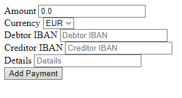
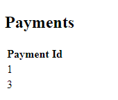
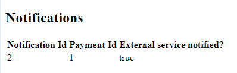
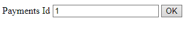

# Banking System

Homework task to create a simple Banking System solution.

## Getting Started

In order to run the project a small amount of prerequisites and additional steps have to be fulfilled.

### Prerequisites

+ IntelliJ IDE

### Running

+ Open `bankingSystem`project using Intellij IDE
+ Select `pom.xml` file and import all dependencies
+ Choose `BankOfEdgarasApplication.java` file and click `Run` button
+ Wait until the applications starts running
+ Open web browser and type `localhost:8080`

## Technologies

+ Java programming language
+ Java Spring Boot framework
+ Thymeleaf framework
+ h2 database

## What has been implemented:

+ Choose between 3 different types of payments a client wants to make: TYPE1, TYPE2, TYPE3
+ Query all payments
+ Query payments by amount
+ Query payments by id
+ Log clients country 
+ Notify 2 external services (`google` and `bing`) about successful payment
+ Saving information to Database about successful or unsuccessful notification of the 2 external services
+ User interface for almost all the functionality

## REST resources endpoints:

+ `localhost:8080/index` - Main page
+ `localhost:8080/payments` - Lists all active payments
+ `localhost:8080/payments/{id}` - Returns a specific payment found by `id`
+ `localhost:8080/payments/amount/{amount}` - Lists all payments found by `amount`
+ `localhost:8080/addtype1payment` `GET` - Returns form for making `TYPE1` `payment`
+ `localhost:8080/addtype1payment` `POST` - Creates `TYPE1` `payment`
+ `localhost:8080/addtype2payment` `GET` - Returns form for making `TYPE2` `payment`
+ `localhost:8080/addtype2payment` `POST` - Creates `TYPE2` `payment`
+ `localhost:8080/addtype3payment` `GET` - Returns form for making `TYPE3` `payment`
+ `localhost:8080/addtype3payment` `POST` - Creates `TYPE3` `payment`

Most of these requests can also be made by using the existing pages which can be navigated from `localhost:8080/index`

## Existing pages

Index Page

add-typex-payment page

Payments page

Notifications page

Payment by id and by amount looks the same

## Database

In this project `H2` internal database is used. After the program is closed all the previously saved data is lost.

There are 2 entities saved in the database: `Payment` and `Notification`

`Payment` consists of the properties described in the exarcise and there also exists a difference between the types of payments made.
`Notification` consists of the following properties: `id` (automatically generated), `paymentId` (Foreign Key from `Payment`), `notified`.

  

